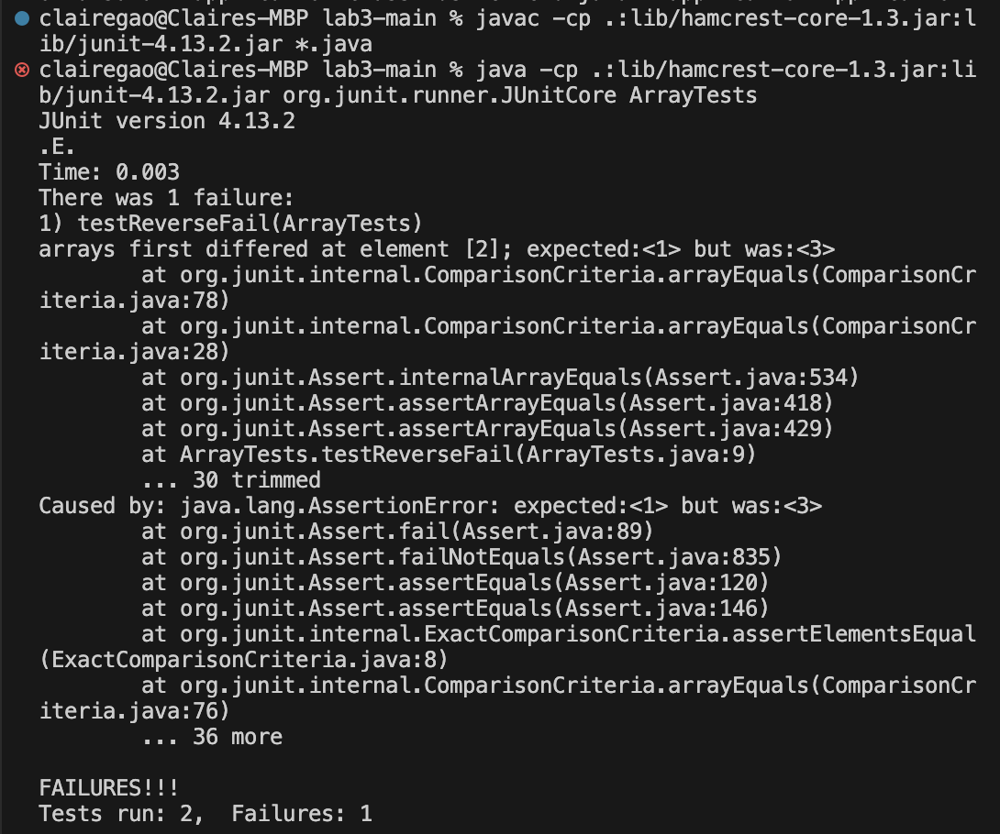

<h1>Lab Report 3</h1>

<h2>Part one</h2>

The input that induces failures :
```
public class ArrayTests {
	@Test 
	public void testReverseFail() {
    		int[] input1 = {1,2,3};
    		ArrayExamples.reverseInPlace(input1);
    		assertArrayEquals(new int[]{3,2,1}, input1);
	}
}
```

The input does not induce failure:

```
public class ArrayTests {
@Test
	public void testReversedPass() {
    		int[] input2 = {0};
    		assertArrayEquals(new int[]{0}, ArrayExamples.reversed(input2));
  	}
}
```

The symptop: 


Bug:
```
static int[] reversed(int[] arr) {
    int[] newArray = new int[arr.length];
    for(int i = 0; i < arr.length; i += 1) {
      arr[i] = newArray[arr.length - i - 1];
    }
    return arr;
  }
```

Debug:
```
static int[] reversed(int[] arr) {
    int[] newArray = new int[arr.length];
    for(int i = 0; i < arr.length; i += 1) {
      newArray[i] = arr[arr.length - i - 1];
    }
    return newArray;
  }
```
In the previous code, it creates a new array, but assigning the values in the new array to arr and return it. Since the new array is empty, the return value would also be empty, so it would not work. In my fixing, I instead assign the values of the input array reversely to the new array and return the new array. 

<h2>Part two</h2>
